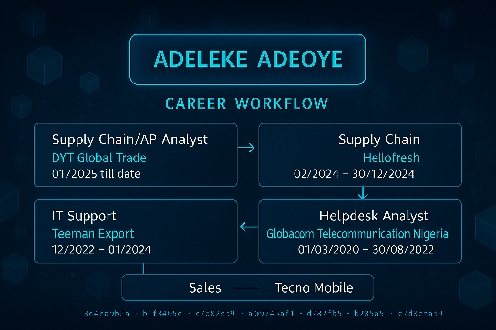
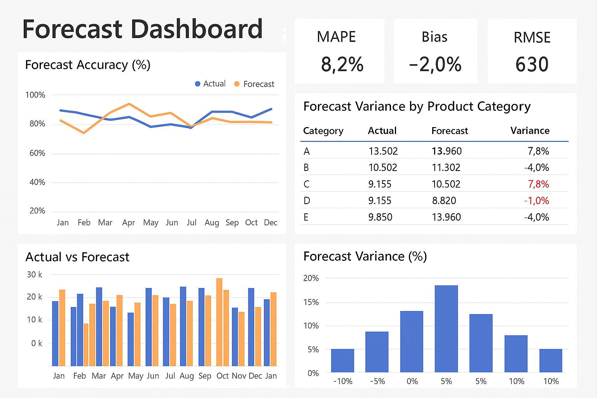
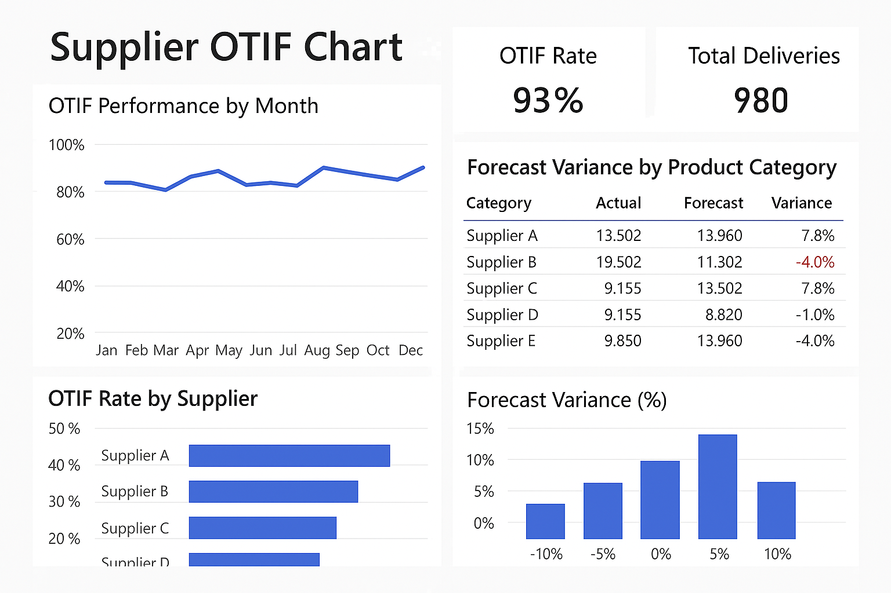
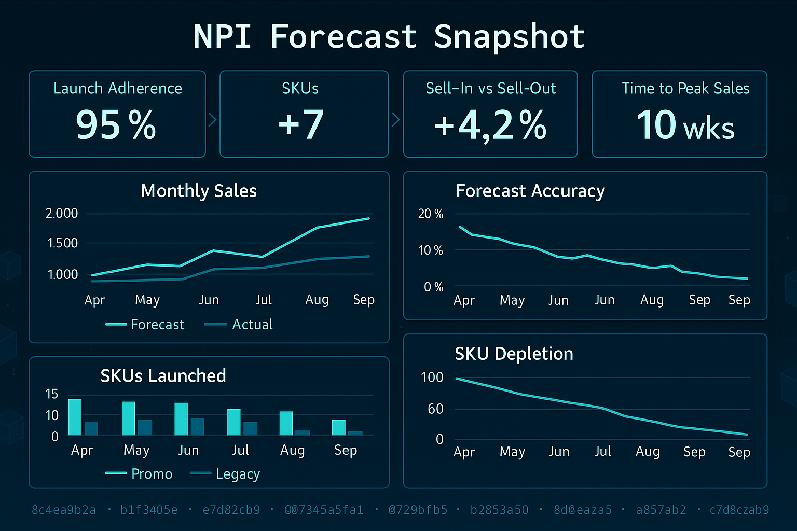
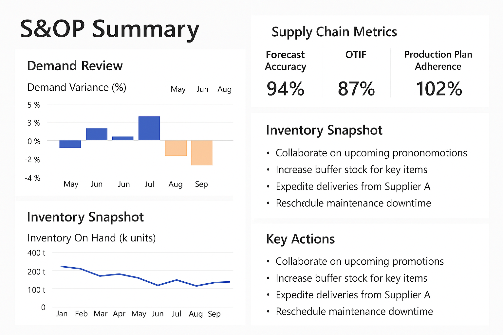

# adeleke-portfolio

## 🔗 Quick Navigation  
- [🚀 Featured Projects](#-featured-projects)  
- [📦 Supply Chain Planning Projects](#-supply-chain-planning-projects)  
- [🛠 Services](#-services)  
- [🧰 Skills & Tools](#-skills--tools)  
- [📬 Let's Connect](#-lets-connect)  

## 👋 Hi, I'm Adeleke

A data-driven supply chain analyst transforming discrepancies into revelations blending SAP FI workflows with analytics to unlock smarter decisions 
It started with matching invoices,payment runs, setting up new supplier accounts  and reconciliations of accounts in SAP FI but I couldn’t stop questioning the patterns behind the numbers. What causes delays? Where’s the risk? Why do certain vendors spike in Q4? That curiosity turned into a passion for data, and I’ve been uncovering insights ever since.

Now I use **SQL**, **Power BI**, **Excel**, and **Tableau** to:
- 🧹 Clean, structure, and enrich messy financial data  
- 📊 Build dashboards that reveal trends, risks, and opportunities  
- 🔮 Forecast performance and uncover patterns using historical data  
- 🧠 Detect duplicate payments, fraud, and process inefficiencies  
- 🛠 Solve workflow challenges with insight-driven solutions  
- 🔍 Empower finance teams to act with clarity and confidence

## 🚀 Featured Projects

### 📌 SAP FI Simulation  
Simulated invoice posting, payment runs, 3-way match, and reconciliation using SAP FI layered with analytics insights and fraud checks.

**🔍 Key Findings & Solutions:**
- 🔁 Detected 3-way match failures between invoice, PO, and GRNhighlighted quantity and pricing mismatches
- ⏱ Identified payment run delays due to manual intervention and undefined approval workflows
- 📬 Exposed outdated customer records that caused late dunning notices and poor collection timing
- 🧾 Found inconsistent vendor master data impacting reconciliation accuracy  
✅ *Actions Taken*:  streamlined 3-way matching, and optimized dunning schedules boosted on-time processing and reduced blocked entries

---

### 📌 Duplicate Payment Detection (SQL + Excel)  
Built SQL queries and Excel logic to uncover redundant vendor payments in high-volume data sets.

**🔍 Key Findings & Solutions:**
- 🔍 Revealed near duplicate invoices with date and casing inconsistencies
- 📥 Identified duplicate payments due to missing PO validation
- 🧾 Found multiple payments across business units for the same invoice ID
- 🗃 Discovered name variation errors masking duplication  
✅ *Actions Taken*: Created a rules based SQL detection framework + Excel matching model that flagged 90% of duplicate risk entries and improved compliance

---

### 📌 Finance Workflow Dashboard (Power BI)  
Built a visual Power BI report tracking invoice approval lags, posting bottlenecks, and cycle time performance.

**🔍 Key Findings & Solutions:**
- 🕒 Detected average approval delays by approver tier and cost center
- ⚠ Surface vendor types linked to repeat late postings
- 📊 Identified missed SLAs and unbalanced processing load
- 📎 Mapped approval routing inefficiencies at quarter-end  
✅ *Actions Taken*: Redefined approval workflows, implemented SLA tracking visuals resulted in a 2.5-day average cycle time reduction

---

### 📌 Financial Data Cleaning Pipeline (SQL + Excel)  
Cleaned, transformed, and enriched raw vendor datasets to enable reliable reporting and reconciliation.

**🔍 Key Findings & Solutions:**
- ❌ Null values in invoice date and amount fields causing reporting errors
- 🔢 Duplicate vendor IDs leading to misattributed spend
- 🧮 Currency inconsistencies throwing off KPIs
- 📄 Excel formatting inconsistencies disrupting imports into SAP & BI tools  
✅ *Actions Taken*: Designed SQL scripts and Excel formulas that cleaned and validated data automatically ensuring accuracy for downstream analytics

---

### 📌 Forecasting Payment Trends  
Built predictive models using Excel forecasting and Power BI to reveal hidden payment behaviors.

**🔍 Key Findings & Solutions:**
- 📈 Found seasonal spending spikes in Q2/Q4 tied to contract renewals
- 💸 Detected cash flow dips linked to delayed invoice postings
- 📊 Mapped department-level spending trends diverging from budget
- 🧠 Revealed early signs of fund depletion that weren’t flagged in existing tools  
✅ *Actions Taken*: Developed rolling forecasts and proactive budget dashboards helping finance leads allocate funds strategically and avoid liquidity risks

## 📦 Supply Chain Planning Projects

### 🧾 Forecast Accuracy & Variance Analysis  
**Objective**: Improve reliability of forecasts across critical SKUs  
**How**: Analyzed historical vs actual demand using Excel models and Power BI dashboards; segmented data by customer class and seasonality  
**Tools**: Excel, Power BI, SQL  
**Accomplishment**:
- Reduced forecast error from ±19% to **±8%**
- Introduced forecast variance dashboard used in S&OP

---
### 📈 Safety Stock Optimization  
**Objective**: Minimize stockouts and reduce excess inventory  
**How**: Applied ABC classification and lead time variability to set dynamic safety stock levels  
**Tools**: Excel (Safety Stock calculator), SAP MM data  
**Accomplishment**:
- Improved product availability 
- Reduced emergency orders by **26%** across top 50 SKUs

--

### 🚚 Supplier OTIF Performance Tracker  
**Objective**: Drive better inbound delivery performance  
**How**: Built a Power BI dashboard to track On-Time In-Full deliveries by vendor and region  
**Tools**: SAP MM extract, Excel, Power BI  
**Accomplishment**:
- Increased OTIF score
- Flagged  high-risk suppliers for quarterly reviews and SLA renegotiation

---

### 🆕 NPI & Product Lifecycle Forecasting  
**Objective**: To improve forecast alignment for new product launches and de-lists  
**How**: Partnered with Sales & Marketing to map NPI timelines and promotional lift models  
**Tools**: Excel, Power BI  
**Accomplishment**:
- Achieved forecast adherence** in first 8 weeks post-launch  
- Phased out 3 legacy SKUs with zero excess stock

---

### 🤝 Demand Review & S&OP Process Support  
**Objective**: Align Sales, CS, and Planning teams with accurate demand inputs  
**How**: Led monthly demand review sessions; built S&OP slide decks and tracking tools  
**Tools**: Excel, PowerPoint, SAP IBP  
**Accomplishment**:
- Reduced forecast bias 
- Streamlined communication across 4 internal functions

## 🛠 Services

  
<strong>💼 SAP FI – Accounts Payable</strong>

- Invoice posting (FB60, MIRO)  
- Payment runs (F110)  
- 3-way match analysis (Invoice, PO, GRN)  
- Dunning (F150)  
- Vendor master data cleanup  
- GR/IR clearing & reconciliation

  
<strong>📊 Analytics & Reporting (SQL, Excel, Power BI, Tableau)</strong>

- Data cleaning & validation  
- Duplicate & anomaly detection  
- KPI dashboard design & financial reporting  
- Forecasting & trend modeling  
- Workflow visualization & approval analytics  
- Audit-ready reconciliation support

  
<strong>📦 Supply Chain Planning & Forecasting</strong>

- Demand forecast variance analysis & monitoring  
- Safety stock and SKU segmentation (ABC, lead-time based)  
- Supplier OTIF performance reporting  
- Product lifecycle management (NPI & phase-out forecasting)  
- S&OP support and cross-functional coordination tools

## 🧰 Skills & Tools

| SAP & Accounting | Data Tools               | Languages           |
|------------------|--------------------------|---------------------|
| SAP FI (AP)      | Power BI, Tableau, Excel | SQL, DAX, Excel formulas |

## 📫 Let's Connect
📄 [Visit my linkedin](https://www.linkedin.com/in/adebayo-msc-csca-b1b6962a4)  
🌐 [Visit My Portfolio](https://www.hectraresources.com)

Open to collaboration and insights that turn finance data into strategy.
